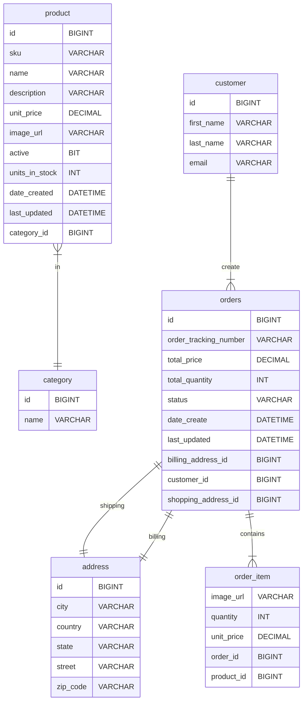

# REST E-COMMERCE

## Requerimientos

- Mostrar lista de productos
- Agregar productos a carrito de compra
- Verificación de carrito de compra
- Autenticación (login/logout)
- Seguimiento de ordenes previas de usuarios autenticados

## Endpoints

| Métodos HTTP | endpoint                                      |
|--------------|-----------------------------------------------|
| GET          | /products                                     |
| GET          | /products/{id}                                |
| GET          | /products/search/byCategoryId?id={categoryId} |
| GET          | /products/search/byNameContaining?name={name} |
| GET          | /categories                                   |
| GET          | /categories/{id}                              |
| POST         | /checkout/purchase                            |
| GET          | /orders/byCustomerEmail?email={customerEmail} |

## Base de datos

## Dependencias

- spring-boot-starter-data-jpa
- spring-boot-starter-data-rest
- spring-boot-starter-oauth2-resource-server
- mysql-connector-java
- lombok

## Environment variables

### Database

- CONNECTION_STRING
- USER_DB
- PASSWORD_DB

### Auth0
- ISSUER
- AUDIENCE